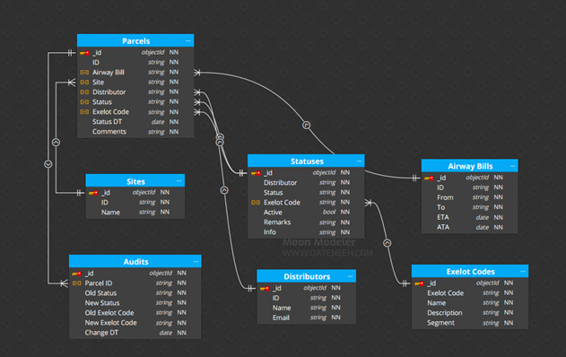

# Exceptional Package Management System

## 📦 Project Overview
This repository contains the backend API for the Exceptional Package Management System, designed to manage parcels that require manual intervention due to delays or status mismatches — within a real-world logistics organization.

The solution improves oversight and response to anomalies in the delivery process by automating status monitoring, alert generation, and reporting. It was developed as part of an academic final project and reflects a complete product cycle: from problem analysis and requirements gathering, through system architecture, implementation, and deployment.

> 🔒 *The Wix-based front-end is a private system and is not included in this repository.*
>
> 📂 *This repository is provided for demonstration purposes only.*

---

## 🚀 Key Features
- **Automated Status Monitoring**: Background jobs continuously scan for outdated statuses (e.g., packages marked as "in transit" for too long).
- **Real-Time Alerts**: Sends alerts to logistics personnel when anomalies are detected.
- **Data Management**: All package data is stored in MongoDB using well-structured collections.
- **Analytics & Reporting**: Custom reports are generated for various stakeholders.
- **Async Task Processing**: CSV file processing and other heavy-lift tasks are handled asynchronously with Celery and Redis.

---

## 🛠️ Tech Stack
- **Python / Flask** – RESTful API development
- **MongoDB** – NoSQL document database
- **Celery + Redis** – Background task queue
- **APScheduler** – Scheduled status scans
- **smtplib (SMTP)** – Email alert system
- **Wix / Velo** – Web-based frontend (not included here)
- **Heroku** – Cloud deployment

---

## 🧠 Architecture Diagram

The system operates as a microservice for logistics oversight. It connects the organization's internal data sources with an external interface for logistics partners and distribution companies.

---

## 🗂️ MongoDB Collections

Each package record includes full traceability: status logs, update timestamps, distributor info, delay flags, and internal notes.

---

## 📊 Performance Snapshot

Real-time data analysis revealed over 20,000 package records scanned with sub-300ms response times per query.

---

## 👥 Role-Based Views
- **Distributor Interface**: Handles bulk status updates.
- **sample of the organization internal view**: Enables management and tracking of all parcels built-in statuses.

| Distributor View                     | Status Mapping Logic              |
|-------------------------------------|-----------------------------------|
|  |  |

---

## Documentation & Presentation

The Exceptional Package Management System provides a practical, scalable foundation for improving operational efficiency in package logistics. Its architecture allows for flexible adaptation and integration with third-party vendors, and its data-centric approach makes it ideal for rapid decision-making.

#### For a more detailed overview of the project’s design, implementation, and outcomes:

  - [Final Project Presentation](final%20project%20presentation.pdf)

---

